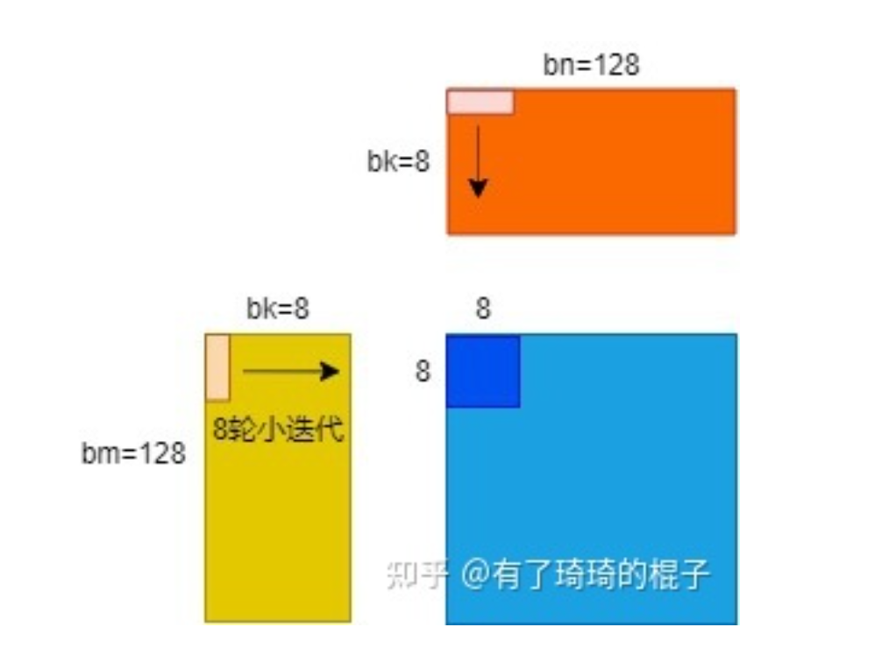
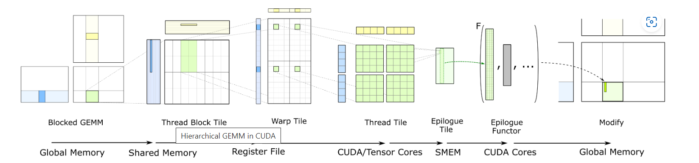

## Cutlass SGEMM Analysis

### Review of GEMM Implementation

#### GEMM general structure

- infrastructure

  1. A -> mxk & B -> kxn & C -> mxn
  2.  $C =\alpha * A\times B^T + \beta* C$ 

- solution

  1. m = M * bm & n = N * bn & k = K * bk
  2. a grid = M * N blocks , each block calculate a bm * bn area
  3. for a block , each time load bm * bk data from A and bk * bn data from B to shared memory
  4. there are K rounds for a block to calculate the target block
  5. bm = X * rm & bn = Y * rn  
  6. there are X * Y threads, and each thread calculate a block of rm * rn 

- illustration

  
  
  
  
- now the above optimization can reach 80% cublas

#### Advance Optimization

- transpose matrix A ( smemA ) and use LDS.128 ( vector read instruction )

- try LDGSTS ?

- prefetch & read/write into different buffer (double buffer)

  we use read SM & write SM to represent the two shared memory

  1. load the data to write SM and write reg
  2. for each iteration, switch read SM & write SM to avoid the latency of accessing mem

  ~~~c++
  for k in 256 big_loop:
  	prefetch next loop data to write_SM
  	// compute in read_SM
  	for iter in 8 small_loop:
  		prefetch next loop data to write_REG
  		compute in read_REG
  ~~~

  

  

- reach 97.5% cublas

#### surpass cutlass

- SASS (Shader Assembly)
  - register bank conflict
  - register reuse

### Cutlass GEMM Implementation

#### code structure

- interface

  `cutlass::gemm::device::Gemm<A_type,A_save,B_type,B_save,C_type,C_save>`

- analysis on code

  

  

### TVM trace

- original script

  ~~~python
  @tvm.script.ir_module
  class MyModuleMatmul:
      @T.prim_func
      def main(A: T.Buffer[(1024, 1024), "float32"], 
               B: T.Buffer[(1024, 1024), "float32"], 
               C: T.Buffer[(1024, 1024), "float32"]) -> None:
          T.func_attr({"global_symbol": "main", "tir.noalias": True})
          for i, j, k in T.grid(1024, 1024, 1024):
              with T.block("C"):
                  vi, vj, vk = T.axis.remap("SSR", [i, j, k])
                  with T.init():
                      C[vi, vj] = 0.0
                  C[vi, vj] = C[vi, vj] + A[vi, vk] * B[vk, vj]
  ~~~
  
- target script

  ~~~python
  @tvm.script.ir_module
  class Module:
      @T.prim_func
      def mm(A: T.Buffer[(1024, 1024), "float32"], B: T.Buffer[(1024, 1024), "float32"], Y: T.Buffer[(1024, 1024), "float32"]) -> None:
          # function attr dict
          T.func_attr({"global_symbol": "mm", "tir.noalias": True})
          # body
          # with T.block("root")
          Y_local = T.alloc_buffer([1024, 1024], dtype="float32", scope="local")
          B_shared = T.alloc_buffer([1024, 1024], dtype="float32", scope="shared")
          A_shared = T.alloc_buffer([1024, 1024], dtype="float32", scope="shared")
          B_shared_local = T.alloc_buffer([1024, 1024], dtype="float32", scope="local")
          A_shared_local = T.alloc_buffer([1024, 1024], dtype="float32", scope="local")
          A_local = T.alloc_buffer([1024, 1024], dtype="float32", scope="local")
          B_local = T.alloc_buffer([1024, 1024], dtype="float32", scope="local")
          for i1_0 in T.thread_binding(8, thread="blockIdx.y"):
              for i0_0 in T.thread_binding(8, thread="blockIdx.x"):
                  for i1_1 in T.thread_binding(16, thread="threadIdx.y"):
                      for i0_1 in T.thread_binding(16, thread="threadIdx.x"):
                          for i0_2_init, i1_2_init in T.grid(8, 8):
                              with T.block("Y_init"):
                                  i = T.axis.spatial(1024, i0_0 * 128 + i0_1 * 8 + i0_2_init)
                                  j = T.axis.spatial(1024, i1_0 * 128 + i1_1 * 8 + i1_2_init)
                                  T.reads()
                                  T.writes(Y_local[i, j])
                                  Y_local[i, j] = T.float32(0)
                          for i2_0 in T.serial(64):
                              for ax0_ax1_fused_0 in T.thread_binding(16, thread="threadIdx.y"):
                                  for ax0_ax1_fused_1 in T.thread_binding(16, thread="threadIdx.x"):
                                      for ax0_ax1_fused_2_0 in T.serial(2):
                                          for ax0_ax1_fused_2_1 in T.vectorized(4):
                                              with T.block("A_local"):
                                                  v0 = T.axis.spatial(1024, i0_0 * 128 + (ax0_ax1_fused_0 * 128 + ax0_ax1_fused_1 * 8 + ax0_ax1_fused_2_0 * 4 + ax0_ax1_fused_2_1) // 16)
                                                  v1 = T.axis.spatial(1024, i2_0 * 16 + (ax0_ax1_fused_0 * 128 + ax0_ax1_fused_1 * 8 + ax0_ax1_fused_2_0 * 4 + ax0_ax1_fused_2_1) % 16)
                                                  T.reads(A[v0, v1])
                                                  T.writes(A_local[v0, v1])
                                                  A_local[v0, v1] = A[v0, v1]
                              for ax0_ax1_fused_0 in T.thread_binding(16, thread="threadIdx.y", annotations={"software_pipeline_order":[0, 3, 1, 4, 2], "software_pipeline_stage":[0, 0, 0, 0, 1]}):
                                  for ax0_ax1_fused_1 in T.thread_binding(16, thread="threadIdx.x"):
                                      for ax0_ax1_fused_2_0 in T.serial(2):
                                          for ax0_ax1_fused_2_1 in T.vectorized(4):
                                              with T.block("A_shared"):
                                                  v0 = T.axis.spatial(1024, i0_0 * 128 + (ax0_ax1_fused_0 * 128 + ax0_ax1_fused_1 * 8 + ax0_ax1_fused_2_0 * 4 + ax0_ax1_fused_2_1) // 16)
                                                  v1 = T.axis.spatial(1024, i2_0 * 16 + (ax0_ax1_fused_0 * 128 + ax0_ax1_fused_1 * 8 + ax0_ax1_fused_2_0 * 4 + ax0_ax1_fused_2_1) % 16)
                                                  T.reads(A_local[v0, v1])
                                                  T.writes(A_shared[v1, v0 // 128 * 128 + v0 % 8 // 4 * 64 + v0 % 128 // 8 * 4 + v0 % 4])
                                                  T.block_attr({"double_buffer_scope":0})
                                                  A_shared[v1, v0 // 128 * 128 + v0 % 8 // 4 * 64 + v0 % 128 // 8 * 4 + v0 % 4] = A_local[v0, v1]
                              for ax0_ax1_fused_0 in T.thread_binding(16, thread="threadIdx.y"):
                                  for ax0_ax1_fused_1 in T.thread_binding(16, thread="threadIdx.x"):
                                      for ax0_ax1_fused_2_0 in T.serial(2):
                                          for ax0_ax1_fused_2_1 in T.vectorized(4):
                                              with T.block("B_local"):
                                                  v0 = T.axis.spatial(1024, i2_0 * 16 + (ax0_ax1_fused_0 * 128 + ax0_ax1_fused_1 * 8 + ax0_ax1_fused_2_0 * 4 + ax0_ax1_fused_2_1) // 128)
                                                  v1 = T.axis.spatial(1024, i1_0 * 128 + (ax0_ax1_fused_0 * 128 + ax0_ax1_fused_1 * 8 + ax0_ax1_fused_2_0 * 4 + ax0_ax1_fused_2_1) % 128)
                                                  T.reads(B[v0, v1])
                                                  T.writes(B_local[v0, v1])
                                                  B_local[v0, v1] = B[v0, v1]
                              for ax0_ax1_fused_0 in T.thread_binding(16, thread="threadIdx.y"):
                                  for ax0_ax1_fused_1 in T.thread_binding(16, thread="threadIdx.x"):
                                      for ax0_ax1_fused_2_0 in T.serial(2):
                                          for ax0_ax1_fused_2_1 in T.vectorized(4):
                                              with T.block("B_shared"):
                                                  v0 = T.axis.spatial(1024, i2_0 * 16 + (ax0_ax1_fused_0 * 128 + ax0_ax1_fused_1 * 8 + ax0_ax1_fused_2_0 * 4 + ax0_ax1_fused_2_1) // 128)
                                                  v1 = T.axis.spatial(1024, i1_0 * 128 + (ax0_ax1_fused_0 * 128 + ax0_ax1_fused_1 * 8 + ax0_ax1_fused_2_0 * 4 + ax0_ax1_fused_2_1) % 128)
                                                  T.reads(B_local[v0, v1])
                                                  T.writes(B_shared[v0, v1 // 128 * 128 + v1 % 8 // 4 * 64 + v1 % 128 // 8 * 4 + v1 % 4])
                                                  T.block_attr({"double_buffer_scope":0})
                                                  B_shared[v0, v1 // 128 * 128 + v1 % 8 // 4 * 64 + v1 % 128 // 8 * 4 + v1 % 4] = B_local[v0, v1]
                              for i2_1 in T.unroll(16):
                                  for ax0_0 in T.unroll(2):
                                      for ax0_1 in T.vectorized(4):
                                          with T.block("B_shared_local"):
                                              v0 = T.axis.spatial(1024, i2_0 * 16 + i2_1)
                                              v1 = T.axis.spatial(1024, i1_0 * 128 + i1_1 * 8 + ax0_0 * 4 + ax0_1)
                                              T.reads(B_shared[v0, v1 // 128 * 128 + v1 % 8 // 4 * 64 + v1 % 128 // 8 * 4 + v1 % 4])
                                              T.writes(B_shared_local[v0, v1])
                                              B_shared_local[v0, v1] = B_shared[v0, v1 // 128 * 128 + v1 % 8 // 4 * 64 + v1 % 128 // 8 * 4 + v1 % 4]
                                  for ax0_0 in T.unroll(2):
                                      for ax0_1 in T.vectorized(4):
                                          with T.block("A_shared_local"):
                                              v0 = T.axis.spatial(1024, i0_0 * 128 + i0_1 * 8 + ax0_0 * 4 + ax0_1)
                                              v1 = T.axis.spatial(1024, i2_0 * 16 + i2_1)
                                              T.reads(A_shared[v1, v0 // 128 * 128 + v0 % 8 // 4 * 64 + v0 % 128 // 8 * 4 + v0 % 4])
                                              T.writes(A_shared_local[v0, v1])
                                              A_shared_local[v0, v1] = A_shared[v1, v0 // 128 * 128 + v0 % 8 // 4 * 64 + v0 % 128 // 8 * 4 + v0 % 4]
                                  for i0_2, i1_2 in T.grid(8, 8):
                                      with T.block("Y_update"):
                                          i = T.axis.spatial(1024, i0_0 * 128 + i0_1 * 8 + i0_2)
                                          j = T.axis.spatial(1024, i1_0 * 128 + i1_1 * 8 + i1_2)
                                          k = T.axis.reduce(1024, i2_0 * 16 + i2_1)
                                          T.reads(Y_local[i, j], A_shared_local[i, k], B_shared_local[k, j])
                                          T.writes(Y_local[i, j])
                                          Y_local[i, j] = Y_local[i, j] + A_shared_local[i, k] * B_shared_local[k, j]
                          for ax0 in T.serial(8):
                              for ax1 in T.vectorized(8):
                                  with T.block("Y_local"):
                                      v0 = T.axis.spatial(1024, i0_0 * 128 + i0_1 * 8 + ax0)
                                      v1 = T.axis.spatial(1024, i1_0 * 128 + i1_1 * 8 + ax1)
                                      T.reads(Y_local[v0, v1])
                                      T.writes(Y[v0, v1])
                                      Y[v0, v1] = Y_local[v0, v1]
      
  
  ~~~
  

### Reference

- [CUTLASS: Fast Linear Algebra in CUDA C++ | NVIDIA Technical Blog](https://developer.nvidia.com/blog/cutlass-linear-algebra-cuda/)

  [CUTLASS: Fast Linear Algebra in CUDA C++ - 知乎 (zhihu.com)](https://zhuanlan.zhihu.com/p/461060382) （translated version）

- [深入浅出GPU优化系列：GEMM优化（一） - 知乎 (zhihu.com)](https://zhuanlan.zhihu.com/p/435908830) 

- [深入浅出GPU优化系列：GEMM优化（二） - 知乎 (zhihu.com)](https://zhuanlan.zhihu.com/p/442930482) 

- [深入浅出GPU优化系列：GEMM优化（三） - 知乎 (zhihu.com)](https://zhuanlan.zhihu.com/p/481600052) 

- [SGEMM · NervanaSystems/maxas Wiki (github.com)](https://github.com/NervanaSystems/maxas/wiki/SGEMM) 

- [CUDA 矩阵乘法终极优化指南 - 知乎 (zhihu.com)](https://zhuanlan.zhihu.com/p/410278370) 

- [cuda_sgemm/gemm.cu at master · niuhope/cuda_sgemm (github.com)](https://github.com/niuhope/cuda_sgemm/blob/master/gemm.cu) 

- [Why use CUTLASS instead of CUBLAS for GEMM? What are the advantages of CUTLASS ? · Issue #109 · NVIDIA/cutlass (github.com)](https://github.com/NVIDIA/cutlass/issues/109) 

- [Liu-xiandong/How_to_optimize_in_GPU: This is a series of GPU optimization topics. Here we will introduce how to optimize the CUDA kernel in detail. I will introduce several basic kernel optimizations, including: elementwise, reduce, sgemv, sgemm, etc. The performance of these kernels is basically at or near the theoretical limit. (github.com)](https://github.com/Liu-xiandong/How_to_optimize_in_GPU) 

- [(27 封私信 / 80 条消息) 自己写的CUDA矩阵乘法能优化到多快？ - 知乎 (zhihu.com)](https://www.zhihu.com/question/41060378/answer/2645323107)

- [CUDA矩阵乘法的优化 · wu-kan](https://wu-kan.cn/2019/12/13/CUDA矩阵乘法的优化/)

- [cutlass/efficient_gemm.md at master · NVIDIA/cutlass (github.com)](https://github.com/NVIDIA/cutlass/blob/master/media/docs/efficient_gemm.md)

- [wangzyon/NVIDIA_SGEMM_PRACTICE: Step-by-step optimization of CUDA SGEMM (github.com)](https://github.com/wangzyon/NVIDIA_SGEMM_PRACTICE) 

- [a hgemm tvm schedule | LeiWang1999 (leiblog.wang)](https://leiblog.wang/a-hgemm-tvm-schedule/) 

- [深入浅出GPU优化系列：reduce优化 - 知乎 (zhihu.com)](https://zhuanlan.zhihu.com/p/426978026) 
